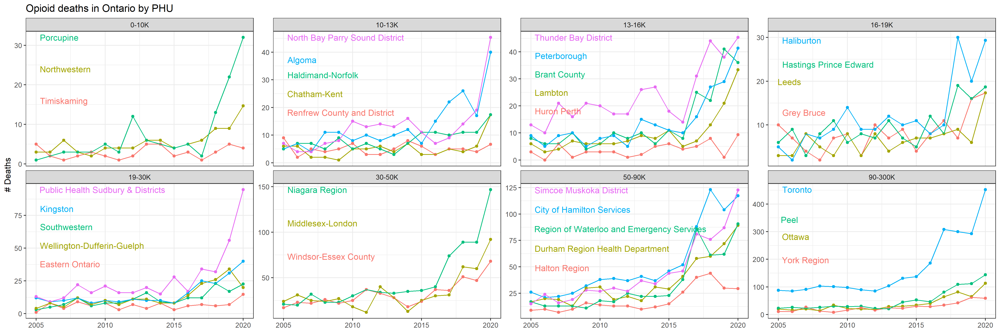
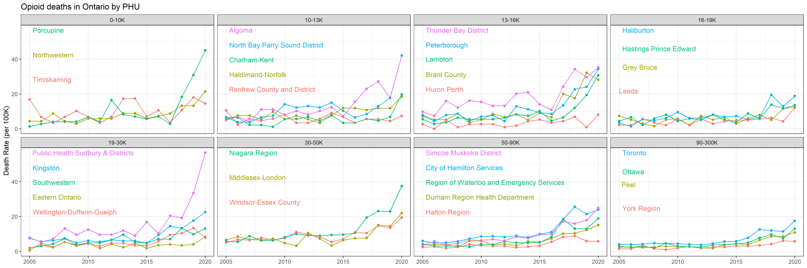

```{r setup, include=FALSE}
knitr::opts_chunk$set(echo = TRUE)
```

For knitting to markdown see [here](https://stackoverflow.com/questions/31914161/how-to-convert-rmd-into-md-in-r-studio/31914830).


## (1) Ontario wide opioid deaths

<p align="center">
<table><tr>
<td>  </td>
<td> <p align="center"> </td>
</tr></table>
</p>


<br>

## (2) PHU-level opioid deaths


<p align="center"></p>
<br>
<p align="center"></p>

<br>
